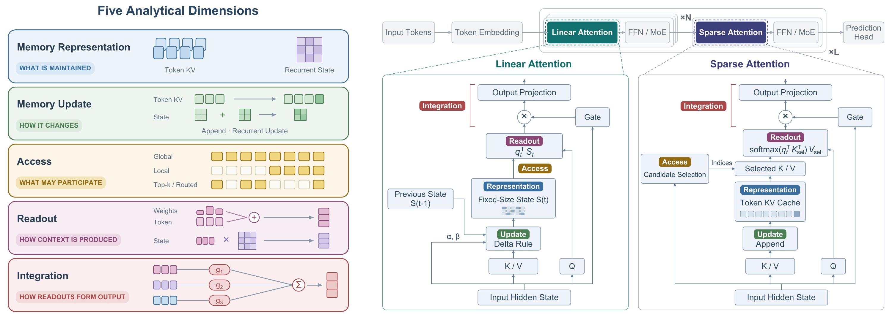

<div align="center">

<h1>The Evolution of Attention in Large Language Models: Mechanisms, Trade-offs, and Emerging Trends</h1>

<p><strong>Zhentao Tan, Jingyi Shen, Yanbo Li, Yao Liu, Yue Wu, Jieping Ye</strong><br>
Alibaba Token Hub, Alibaba Group</p>

[](https://arxiv.org/pdf/2609.39661)
[](#survey-index)
[](#survey-index)
[](#contributing)
[](#citation)

</div>

<div align="center">

**English** | [中文版](./README-ZH.md)

[Full Text](https://arxiv.org/abs/2609.39661)

A living survey and structured literature map of efficient sequence architectures, explaining how they have evolved from a **memory-centric perspective**.

</div>

## Overview


This repository accompanies the survey “[The Evolution of Attention in Large Language Models: Mechanisms, Trade-offs, and Emerging Trends](https://arxiv.org/abs/2609.39661).”

The survey examines efficient sequence architectures—from Softmax and Sparse Attention to Linear Attention, State Space Models, and Hybrid designs—through a unifying concept: **model-internal contextual memory**. As new architectures continue to emerge rapidly, it asks a common question: beneath their diverse designs, are they all solving the same problem—how to manage their own contextual memory?

To connect research directions that are often studied in isolation, the survey introduces a five-dimensional analytical lens:

- **Memory Representation** — what form the context is stored in
- **Memory Update** — how new information is written
- **Access** — how stored memory is selected
- **Readout** — how it is retrieved
- **Integration** — how it is combined back into computation

<div align="center">



</div>

Drawing on 59 release-level records across 14 major model lineages, together with a structured comparison of 11 high-performing open-weight models, the analysis shows that memory processing is increasingly coordinated not only across time, but also across network depth.

The resulting framework provides a common language for comparing today's architectures and points toward future designs built on stateful, multidimensional, and selectively routed memory.

## Core Framework


Different sequence architectures make preceding context available through visibly different operators. Softmax Attention retains separately addressable units, Sparse Attention limits which units are examined, and recurrent mechanisms continually compress history into one or more states. The survey compares them functionally as systems that maintain and use **contextual memory**: model-internal, input-dependent information available while processing the current sequence. This includes token KV entries, compressed tokens or chunks, memory slots, associative matrices, structured recurrent states, and heterogeneous combinations, but excludes pretrained parameters and external retrieval corpora.

Let $t$ be the current sequence position, $x_t$ the input to the memory mechanism, and $q_t$ the representation that queries contextual memory. A memory schema $\rho$ specifies the representation type, organization, granularity, capacity, and persistence.

**1. Memory Representation.** The maintained memory $\mathcal{M}_t$ must belong to the state space admitted by its schema:

<div align="center">

$$
\mathcal{M}_t \in \mathfrak{M}_{\rho}.
$$

</div>

The schema may describe a growing list of token KVs, bounded summary slots, an associative matrix, a structured recurrent state, or several heterogeneous paths. Representation therefore asks both how much history remains covered and whether individual historical units remain separately addressable.

**2. Memory Update.** Let $\mathcal{M}_t^{-}$ and $\mathcal{M}_t^{+}$ denote memory immediately before and after processing the current input. Update is defined abstractly as:

<div align="center">

$$
\mathcal{M}_t^{+}=\mathrm{Update}_{\rho}\!\left(\mathcal{M}_t^{-},x_t\right).
$$

</div>

This operator covers append-only KV caches, compression into bounded slots, recurrent state transitions, decay, Delta corrections, and controlled erase-write rules. It specifies how memory changes, not which parts a query will use.

**3. Access.** Let $\widehat{\mathcal{M}}_t$ be the memory view exposed to the read path; depending on the mechanism, it may be the state before or after the current update. Access constructs the eligible view $\mathcal{C}_t$:

<div align="center">

$$
\mathcal{C}_t=\mathrm{Access}_{\rho}\!\left(q_t,\widehat{\mathcal{M}}_t\right).
$$

</div>

The result may contain all causal token memories, a local or routed subset of tokens or blocks, one or more recurrent-state interfaces, and any routing metadata needed by the next step.

**4. Readout.** Readout determines how the query extracts contextual information from the eligible view:

<div align="center">

$$
r_t=\mathrm{Readout}_{\rho}\!\left(q_t,\mathcal{C}_t\right).
$$

</div>

Examples include normalized query-key aggregation, associative-state contraction, and structured state projection. Thus, Access answers **what may be read**, whereas Readout answers **how eligible information is weighted, decoded, or aggregated**.

**5. Integration.** Integration transforms one or more completed readouts into the memory module output:

<div align="center">

$$
o_t=\mathrm{Integration}_{\rho}\!\left(r_t;x_t\right).
$$

</div>

Here $r_t$ may be one vector or a collection of head-, branch-, or path-level readouts. Integration includes output projection, concatenation, summation, gating, conditional routing, and fusion across heterogeneous memory paths.

These equations define functional roles rather than a universal computational graph. One operation may implement several roles at once: changing Representation can alter Access, an input-conditioned transition can jointly change Representation and Update, and a hierarchical sparse index can affect both address representation and candidate selection.

<a id="classification-logic-and-family-mapping"></a>

## Classification Logic and Family Mapping


The survey taxonomy and the five-dimensional framework serve different purposes. The five research lines follow their principal technical questions and historical development; they are not mechanically derived from the five dimensions. Each work is assigned a principal research line according to its central contribution and lineage. A small number of cross-cutting methods are also indexed in a secondary table when they substantively contribute to another design direction; consequently, the list contains 131 classification records for 128 unique works. Dimensional tags provide a multi-label description of the memory functions each method modifies, allowing methods from different research lines to be compared when they intervene in the same functional role.

**P** marks a dimension commonly treated as a primary design target, while **S** marks a dimension usually inherited from the base mechanism or modified only in particular subfamilies. The mapping is interpretive rather than exhaustive: all five dimensions remain applicable to every research line.

| Research line | Memory substrate | Representation | Update | Access | Readout | Integration |
|---|---|:---:|:---:|:---:|:---:|:---:|
| Softmax Attention | Explicit memory units | **P** | **P** | **S** | **S** | **S** |
| Sparse Attention | Explicit token/block KV | **S** | **S** | **P** | **S** | **S** |
| Linear Attention | Associative recurrent state | **P** | **P** | **S** | **S** | **S** |
| State Space Models | Structured recurrent state | **P** | **P** | **S** | **S** | **S** |
| Hybrid Architecture | Heterogeneous memory substrates | **P** | **S** | **S** | **S** | **S** |

Softmax Attention primarily reduces redundancy or reorganizes explicit memory through Representation and Update. Sparse Attention usually preserves token- or block-level content memory and a Softmax Readout, while making candidate construction and access-budget allocation its central Access problem. Linear Attention and State Space Models focus on how recurrent states are represented and updated; Access, Readout, and Integration become more explicit in routed, gated, or multi-state variants.

Hybrid Architecture requires a different interpretation because it composes heterogeneous mechanisms or access regimes rather than introducing one additional memory operator. Representation is therefore its primary family-level axis, while its effects on Update, Access, Readout, and Integration depend on whether composition occurs across layers, heads, branches, or tokens.

<a id="architecture-landscape-and-future-directions"></a>

## Architecture Landscape and Future Directions


Publicly documented LLM attention is **diversifying rather than converging**. Across 59 release-level records from 14 major model lineages, 58 are classifiable: 32 use one principal family and 26 are Hybrid, with Hybrid records rising from 0/6 in 2022–2023 to 17/27 in 2026. Most Hybrid designs still use predetermined layer-wise schedules, while only five records explicitly reuse KV representations, indexes, or Top-k decisions across layers. The frozen frontier snapshot below reinforces this coexistence: the 11 selected high-performing open-weight model endpoints span full GQA, sparse attention, latent compression, and recurrent–explicit hybrids, yet every architecture retains an explicit token-retrieval path. These observations describe adoption patterns and do not attribute model quality to any single mechanism.

**Attention structures of selected high-performing open-weight model endpoints.** The snapshot was captured on September 22, 2026; model size reports total parameters, with disclosed active parameters in parentheses.

| Model endpoint | First Release | Model size | Attention structure |
|---|:---:|:---:|---|
| MiMo-V2.6-Pro | 2026.09 | 1.02T (42B active) | 60 SWA-GQA layers + 10 global-GQA layers |
| DeepSeek-V4.1-Flash (max) | 2026.09 | 552B (8B active prefill; 16B active decode) | CSA2 with SWA; cross-layer KV, index, and Top-k reuse |
| K2-Horizon-375B-A23B | 2026.09 | 375B (23B active) | Full GQA |
| GLM-5.3-Flash | 2026.08 | 320B (18B active) | 34 KDA layers + 11 compressed-indexer DSA layers |
| GLM-5.3 (max) | 2026.08 | 744B (40B active) | MLA-based DSA with IndexShare/IndexCache |
| Qwen3.8-Flash-Next | 2026.08 | 176B; 125B main (6B active) | 3 GDN layers per 1 QSA layer |
| DeepSeek-V4 Pro 0813 (max) | 2026.08 | 1.6T (49B active) | CSA/HCA layer-wise hybrid |
| Qwen3.8-2.4T-A95B | 2026.08 | 2.4T (95B active) | 3 Gated DeltaNet layers per 1 gated full-GQA layer |
| Qwen3.8-27B (xhigh) | 2026.08 | 27B | 3 Gated DeltaNet layers per 1 gated full-GQA layer |
| Kimi K3 (max) | 2026.07 | 2.8T (104B active) | 3 KDA layers per 1 Gated MLA layer |
| MiniMax-M3 | 2026.06 | 428B (23B active) | 3 dense-attention layers + 57 MSA layers |

### Three-Level Synthesis

Rather than viewing architectural evolution as a succession of operator replacements, the survey interprets it as an expanding redesign of contextual memory—from mechanism-level control, through architecture-level coordination, to future stateful memory systems:

> 🔵 **Mechanism Level — Expanding Control Scopes**
>
> Explicit-memory and state-based methods retain different memory interfaces, but both expand control across an increasingly overlapping set of memory functions.

> 🔵 **Architecture Level — Memory Organization across Depth**
>
> Layer-wise composition distributes complementary memory processing across representational stages, while cross-layer reuse extends the lifetime of selected memory and routing artifacts. Together, they make network depth an emerging dimension of memory organization.

> 🔵 **Forward-Looking Level — Stateful Multidimensional Memory Routing**
>
> The depth-wise perspective combines with temporal scope, substrate type, and representation granularity to motivate coordinated Sparse Write and Sparse Read over persistent contextual memory.

<a id="literature-index"></a>

## Survey Index


- [Softmax Attention](#softmax-attention)
  - [Memory-Representation Efficiency](#memory-representation-efficiency)
  - [Sequence-Representation Compression](#sequence-representation-compression)
  - [Readout and Integration Modulation](#readout-and-integration-modulation)
- [Sparse Attention](#sparse-attention)
  - [Structure-Constrained Sparse Attention](#structure-constrained-sparse-attention)
  - [Self-Routing Sparse Attention](#self-routing-sparse-attention)
  - [Auxiliary-Proxy Sparse Routing](#auxiliary-proxy-sparse-routing)
  - [Temporal and Cross-Layer Reuse](#temporal-and-cross-layer-reuse)
- [Linear Attention](#linear-attention)
  - [Memory Update Rules](#memory-update-rules)
  - [Capacity Expansion](#capacity-expansion)
  - [Temporal Expansion](#temporal-expansion)
  - [Auxiliary Coordination and Routing](#auxiliary-coordination-and-routing)
- [State Space Models](#state-space-models)
  - [State Dynamics and Selective Control](#state-dynamics-and-selective-control)
  - [State Organization and Read-Write Refinements](#state-organization-and-read-write-refinements)
- [Hybrid Architecture](#hybrid-architecture)
  - [Layer-wise Hybrid](#layer-wise-hybrid)
  - [Head-wise Hybrid](#head-wise-hybrid)
  - [Branch-wise Hybrid](#branch-wise-hybrid)
  - [Token-wise Hybrid](#token-wise-hybrid)


<a id="softmax-attention"></a>

## Softmax Attention


Softmax Attention preserves explicitly enumerable memory units and normalized Softmax readout. Its main design directions reduce per-token representation cost, compress long histories, or modify how attention scores and head outputs are integrated.

<a id="memory-representation-efficiency"></a>

### Memory-Representation Efficiency

This category reduces the KV representation cost of each token while retaining exact Softmax readout.

  - **Head-Sharing Continuum:** uses MHA as the independent-KV-head baseline, then progressively shares KV states across query heads through GQA and MQA to reduce cache size and decoding bandwidth.
  - **Channel Compression:** stores each token in lower-dimensional latent KV channels while preserving token-level retrieval.
  - **Cross-Layer KV Sharing:** reuses content-bearing KV states across layers instead of caching a separate copy per layer.

| Paper | Subcategory | First Release | Five-Dimensional Mapping |
|---|---|---:|---|
| [Attention Is All You Need](https://proceedings.neurips.cc/paper/7181-attention-is-all-you-need)   | Head-Sharing Continuum | 2017.06 |  |
| [Fast Transformer Decoding: One Write-Head is All You Need](https://arxiv.org/abs/1911.02150)  | Head-Sharing Continuum | 2019.11 |  |
| [GQA: Training Generalized Multi-Query Transformer Models from Multi-Head Checkpoints](https://aclanthology.org/2023.emnlp-main.298/)   | Head-Sharing Continuum | 2023.05 |  |
| [DeepSeek-V2: A Strong, Economical, and Efficient Mixture-of-Experts Language Model](https://arxiv.org/abs/2405.04434)  | Channel Compression | 2024.05 |  |
| [TransMLA: Multi-Head Latent Attention Is All You Need](https://arxiv.org/abs/2502.07864)  | Channel Compression | 2025.02 |  |
| [Reducing Transformer Key-Value Cache Size with Cross-Layer Attention](https://arxiv.org/abs/2405.12981)  | Cross-Layer KV Sharing | 2024.05 |   |

<a id="sequence-representation-compression"></a>

### Sequence-Representation Compression

This category compresses history as sequence length grows.

  - **Fixed-Capacity Recurrent Memory:** repeatedly consolidates history into a bounded set of persistent states or slots.
  - **Dynamic-Resolution Memory:** preserves recent detail while representing older context with progressively coarser summaries.

| Paper | Subcategory | First Release | Five-Dimensional Mapping |
|---|---|---:|---|
| [Transformer-XL: Attentive Language Models Beyond a Fixed-Length Context](https://arxiv.org/abs/1901.02860)  | Fixed-Capacity Recurrent Memory | 2019.01 |   |
| [Compressive Transformers for Long-Range Sequence Modelling](https://arxiv.org/abs/1911.05507)  | Fixed-Capacity Recurrent Memory | 2019.11 |   |
| [Recurrent Memory Transformer](https://arxiv.org/abs/2207.06881)  | Fixed-Capacity Recurrent Memory | 2022.07 |   |
| [TransformerFAM: Feedback attention is working memory](https://arxiv.org/abs/2404.09173)  | Fixed-Capacity Recurrent Memory | 2024.04 |   |
| [Trellis: Learning to Compress Key-Value Memory in Attention Models](https://arxiv.org/abs/2512.23852)  | Fixed-Capacity Recurrent Memory | 2025.12 |   |
| [Lattice: Learning to Compress the Cache in the Attention](https://research.google/pubs/lattice-learning-to-compress-the-cache-in-the-attention/)  | Fixed-Capacity Recurrent Memory | 2025.04 |   |
| [Kwai Summary Attention Technical Report](https://arxiv.org/abs/2604.24432)  | Dynamic-Resolution Memory | 2026.04 |   |
| [DeepSeek-V4: Towards Highly Efficient Million-Token Context Intelligence](https://arxiv.org/abs/2606.19348)  | Dynamic-Resolution Memory | 2026.06 |   |

<a id="readout-and-integration-modulation"></a>

### Readout and Integration Modulation

This category leaves the underlying memory set intact and changes attention readout or multi-head integration.

  - **Score and Attention-Map Modulation:** transforms attention scores or maps before value aggregation.
  - **Head Routing and Output Gating:** selects or rescales completed head readouts during multi-head integration.

| Paper | Subcategory | First Release | Five-Dimensional Mapping |
|---|---|---:|---|
| [Talking-Heads Attention](https://arxiv.org/abs/2003.02436)  | Score and Attention-Map Modulation | 2020.03 |  |
| [Improving Transformers with Dynamically Composable Multi-Head Attention](https://arxiv.org/abs/2405.08553)  | Score and Attention-Map Modulation | 2024.05 |  |
| [Differential Transformer](https://arxiv.org/abs/2410.05258)  | Score and Attention-Map Modulation | 2024.10 |  |
| [Forgetting Transformer: Softmax Attention with a Forget Gate](https://arxiv.org/abs/2503.02130)  | Score and Attention-Map Modulation | 2025.03 |  |
| [MoH: Multi-Head Attention as Mixture-of-Head Attention](https://arxiv.org/abs/2410.11842)  | Head Routing and Output Gating | 2024.10 |  |
| [Gated Attention for Large Language Models: Non-linearity, Sparsity, and Attention-Sink-Free](https://arxiv.org/abs/2505.06708)  | Head Routing and Output Gating | 2025.05 |  |

<a id="sparse-attention"></a>

## Sparse Attention


Sparse Attention retains fine-grained KV candidates while restricting the support read by each query. The taxonomy distinguishes where sparse supports come from, at what granularity they are formed, and whether routing results are reused.

<a id="structure-constrained-sparse-attention"></a>

### Structure-Constrained Sparse Attention

This category restricts accessible KV pairs with stable structural patterns.

  - **Architecture-Prescribed Patterns:** defines the sparse connectivity topology before training.
  - **Post-hoc Discovered Patterns:** derives inference-time sparse rules from regularities in trained dense models.

| Paper | Subcategory | First Release | Five-Dimensional Mapping |
|---|---|---:|---|
| [Generating Long Sequences with Sparse Transformers](https://arxiv.org/abs/1904.10509)  | Architecture-Prescribed Patterns | 2019.04 |  |
| [Longformer: The Long-Document Transformer](https://arxiv.org/abs/2004.05150)  | Architecture-Prescribed Patterns | 2020.04 |  |
| [Big Bird: Transformers for Longer Sequences](https://proceedings.neurips.cc/paper/2020/hash/c8512d142a2d849725f31a9a7a361ab9-Abstract.html)   | Architecture-Prescribed Patterns | 2020.07 |  |
| [LongNet: Scaling Transformers to 1,000,000,000 Tokens](https://arxiv.org/abs/2307.02486)  | Architecture-Prescribed Patterns | 2023.07 |  |
| [PowerAttention: Exponentially Scaling of Receptive Fields for Effective Sparse Attention](https://arxiv.org/abs/2503.03588)  | Architecture-Prescribed Patterns | 2025.03 |  |
| [Efficient Streaming Language Models with Attention Sinks](https://arxiv.org/abs/2309.17453)  | Post-hoc Discovered Patterns | 2023.09 |  |
| [LM-Infinite: Zero-Shot Extreme Length Generalization for Large Language Models](https://arxiv.org/abs/2308.16137)  | Post-hoc Discovered Patterns | 2023.08 |  |
| [MInference 1.0: Accelerating Pre-filling for Long-Context LLMs via Dynamic Sparse Attention](https://arxiv.org/abs/2407.02490)  | Post-hoc Discovered Patterns | 2024.07 |  |

<a id="self-routing-sparse-attention"></a>

### Self-Routing Sparse Attention

This category derives sparse candidates from the query and context themselves.

  - **Dynamic Token Grouping:** groups content-similar queries and keys before applying local Softmax attention.
  - **Block Aggregation and Selection:** summarizes and ranks blocks before retrieving their original KV entries.
  - **Summary-Token Routing:** uses learned summary tokens as compact addresses for regions or chunks.

| Paper | Subcategory | First Release | Five-Dimensional Mapping |
|---|---|---:|---|
| [Reformer: The Efficient Transformer](https://arxiv.org/abs/2001.04451)   | Dynamic Token Grouping | 2020.01 |   |
| [Efficient Content-Based Sparse Attention with Routing Transformers](https://arxiv.org/abs/2003.05997)   | Dynamic Token Grouping | 2020.03 |   |
| [Quest: Query-Aware Sparsity for Efficient Long-Context LLM Inference](https://arxiv.org/abs/2406.10774)  | Block Aggregation and Selection | 2024.06 |   |
| [XAttention: Block Sparse Attention with Antidiagonal Scoring](https://arxiv.org/abs/2503.16428)  | Block Aggregation and Selection | 2025.03 |   |
| [MoBA: Mixture of Block Attention for Long-Context LLMs](https://arxiv.org/abs/2502.13189)  | Block Aggregation and Selection | 2025.02 |   |
| [Optimizing Mixture of Block Attention](https://arxiv.org/abs/2511.11571)  | Block Aggregation and Selection | 2025.11 |   |
| [Native Sparse Attention: Hardware-Aligned and Natively Trainable Sparse Attention](https://aclanthology.org/2025.acl-long.1126/)   | Block Aggregation and Selection | 2025.02 |   |
| [InfLLM-V2: Dense-Sparse Switchable Attention for Seamless Short-to-Long Adaptation](https://arxiv.org/abs/2509.24663)  | Block Aggregation and Selection | 2025.09 |   |
| [DashAttention: Differentiable and Adaptive Sparse Hierarchical Attention](https://arxiv.org/abs/2605.18753)  | Block Aggregation and Selection | 2026.05 |   |
| [COBS: Cumulant Order Block Sparse Attention](https://arxiv.org/abs/2607.09052)  | Block Aggregation and Selection | 2026.07 |   |
| [Landmark Attention: Random-Access Infinite Context Length for Transformers](https://arxiv.org/abs/2305.16300)  | Summary-Token Routing | 2023.05 |   |
| [Simplified Sparse Attention via Gist Tokens](https://arxiv.org/abs/2604.20920)  | Summary-Token Routing | 2026.04 |   |
| [Hierarchical Sparse Attention Done Right: Toward Infinite Context Modeling](https://arxiv.org/abs/2607.02980)  | Summary-Token Routing | 2026.07 |   |

<a id="auxiliary-proxy-sparse-routing"></a>

### Auxiliary-Proxy Sparse Routing

This category uses a lightweight auxiliary indexer to estimate candidate supports.

  - **Token-Granularity Proxy Routing:** uses an auxiliary indexer to rank individual token entries.
  - **Block and Compressed-Entry Proxy Routing:** uses proxy representations to rank blocks or compressed entries.

| Paper | Subcategory | First Release | Five-Dimensional Mapping |
|---|---|---:|---|
| [TokenButler: Token Importance is Predictable](https://arxiv.org/abs/2503.07518)  | Token-Granularity Proxy Routing | 2025.03 |  |
| [DeepSeek-V3.2: Pushing the Frontier of Open Large Language Models](https://arxiv.org/abs/2512.02556)  | Token-Granularity Proxy Routing | 2025.12 |  |
| [LongCat Sparse Attention: Taming the Lightning via Streaming-aware Hierarchical Cross-Layer Indexing](https://arxiv.org/abs/2608.01662)  | Token-Granularity Proxy Routing | 2026.08 |  |
| [SAS: Simple Attention Sparsification via End-to-End Optimization of Context Ranking](https://arxiv.org/abs/2609.13141)  | Token-Granularity Proxy Routing | 2026.09 |  |
| [HashAttention: Semantic Sparsity for Faster Inference](https://arxiv.org/abs/2412.14468)  | Token-Granularity Proxy Routing | 2024.12 |  |
| [HATA: Trainable and Hardware-Efficient Hash-Aware Top-k Attention for Scalable Large Model Inference](https://arxiv.org/abs/2506.02572)   | Token-Granularity Proxy Routing | 2025.06 |  |
| [SeerAttention: Learning Intrinsic Sparse Attention in Your LLMs](https://arxiv.org/abs/2410.13276)  | Block and Compressed-Entry Proxy Routing | 2024.10 |   |
| [SeerAttention-R: Sparse Attention Adaptation for Long Reasoning](https://arxiv.org/abs/2506.08889)  | Block and Compressed-Entry Proxy Routing | 2025.06 |   |
| [SpotAttention: Plug-In Block-Sparse Routing for Pretrained Long-Context Transformers](https://arxiv.org/abs/2606.22874)  | Block and Compressed-Entry Proxy Routing | 2026.06 |   |
| [MiniMax Sparse Attention](https://arxiv.org/abs/2606.13392)  | Block and Compressed-Entry Proxy Routing | 2026.06 |   |
| [MiniMax-M3](https://huggingface.co/MiniMaxAI/MiniMax-M3)  | Block and Compressed-Entry Proxy Routing | 2026.06 |   |
| [On the Design of Qwen3.8-Next Architecture: Evaluation, Efficiency, and Training Stability](https://arxiv.org/abs/2608.30320)  | Block and Compressed-Entry Proxy Routing | 2026.08 |   |
| [Qwen3.8-Flash-Next Technical Report and Model Card](https://github.com/QwenLM/Qwen3.8-Flash-Next)  | Block and Compressed-Entry Proxy Routing | 2026.08 |   |
| [DeepSeek-V4: Towards Highly Efficient Million-Token Context Intelligence](https://arxiv.org/abs/2606.19348)  | Block and Compressed-Entry Proxy Routing | 2026.06 |   |

<a id="temporal-and-cross-layer-reuse"></a>

### Temporal and Cross-Layer Reuse

This category amortizes indexing cost by reusing previously computed sparse supports.

  - **Temporal Support Reuse:** reuses candidate supports across nearby queries or decoding steps.
  - **Cross-Layer Index Reuse:** reuses indexes or Top-k decisions across network depth.

| Paper | Subcategory | First Release | Five-Dimensional Mapping |
|---|---|---:|---|
| [Recall Before You Rank: Similarity-Guided Top-$K$ Reuse for Efficient Long-Context Attention](https://arxiv.org/abs/2607.27692)  | Temporal Support Reuse | 2026.07 |   |
| [TidalDecode: Fast and Accurate LLM Decoding with Position Persistent Sparse Attention](https://arxiv.org/abs/2410.05076)  | Cross-Layer Index Reuse | 2024.10 |   |
| [Kascade: A Practical Sparse Attention Method for Long-Context LLM Inference](https://arxiv.org/abs/2512.16391)  | Cross-Layer Index Reuse | 2025.12 |   |
| [IndexCache: Accelerating Sparse Attention via Cross-Layer Index Reuse](https://arxiv.org/abs/2603.12201)  | Cross-Layer Index Reuse | 2026.03 |   |
| [GLM-5.2](https://huggingface.co/zai-org/GLM-5.2)  | Cross-Layer Index Reuse | 2026.06 |   |
| [GLM-5.3](https://huggingface.co/zai-org/GLM-5.3)  | Cross-Layer Index Reuse | 2026.08 |   |
| [You Only Index Once: Cross-Layer Sparse Attention with Shared Routing](https://arxiv.org/abs/2606.06467)  | Cross-Layer Index Reuse | 2026.06 |   |
| [DeepSeek-V4.1-Flash: Pushing the Limits of KV Cache Compression](https://arxiv.org/abs/2609.19969)  | Cross-Layer Index Reuse | 2026.09 |   |
| [HySparse: A Hybrid Sparse Attention Architecture with Oracle Token Selection and KV Cache Sharing](https://arxiv.org/abs/2602.03560)  | Cross-Layer Index Reuse | 2026.02 |   |
| [HySparse2: Hybrid Sparse Attention with Two-Level KV Sharing](https://arxiv.org/abs/2609.26368)  | Cross-Layer Index Reuse | 2026.09 |   |

<a id="linear-attention"></a>

## Linear Attention


Linear Attention replaces an enumerable token cache with one or more recurrent associative states. The canonical formulation uses context-length-independent state, while later variants expand, partition, or organize multiple states to increase capacity and temporal coverage. Its evolution centers on controlled state editing, capacity growth, broader temporal coverage, and auxiliary coordination or routing.

<a id="memory-update-rules"></a>

### Memory Update Rules

This category studies how associative state is retained, erased, and written.

  - **Additive and Corrective Updates:** accumulates associations and may correct prior predictions through Delta-style updates.
  - **Retention and Gated State Editing:** uses decay, retention, and erase/write gates to control state contents.
  - **Loss-Based Online Optimization:** treats recurrent state updates as online optimization against a local objective.

| Paper | Subcategory | First Release | Five-Dimensional Mapping |
|---|---|---:|---|
| [Transformers are RNNs: Fast Autoregressive Transformers with Linear Attention](https://proceedings.mlr.press/v119/katharopoulos20a.html)   | Additive and Corrective Updates | 2020.06 |  |
| [Linear Transformers Are Secretly Fast Weight Programmers](https://arxiv.org/abs/2102.11174)  | Additive and Corrective Updates | 2021.02 |  |
| [Parallelizing Linear Transformers with the Delta Rule over Sequence Length](https://arxiv.org/abs/2406.06484)  | Additive and Corrective Updates | 2024.06 |  |
| [DeltaProduct: Improving State-Tracking in Linear RNNs via Householder Products](https://arxiv.org/abs/2502.10297)  | Additive and Corrective Updates | 2025.02 |  |
| [Retentive Network: A Successor to Transformer for Large Language Models](https://arxiv.org/abs/2307.08621)  | Retention and Gated State Editing | 2023.07 |  |
| [MiniMax-01: Scaling Foundation Models with Lightning Attention](https://arxiv.org/abs/2501.08313)  | Retention and Gated State Editing | 2025.01 |  |
| [RWKV: Reinventing RNNs for the Transformer Era](https://arxiv.org/abs/2305.13048)  | Retention and Gated State Editing | 2023.05 |  |
| [Eagle and Finch: RWKV with Matrix-Valued States and Dynamic Recurrence](https://arxiv.org/abs/2404.05892)  | Retention and Gated State Editing | 2024.04 |  |
| [Gated Linear Attention Transformers with Hardware-Efficient Training](https://arxiv.org/abs/2312.06635)  | Retention and Gated State Editing | 2023.12 |  |
| [HGRN2: Gated Linear RNNs with State Expansion](https://arxiv.org/abs/2404.07904)  | Retention and Gated State Editing | 2024.04 |  |
| [Gated Delta Networks: Improving Mamba2 with Delta Rule](https://proceedings.iclr.cc/paper_files/paper/2025/hash/4904fad153f6434a7bcf04465d4be2cc-Abstract-Conference.html)   | Retention and Gated State Editing | 2024.12 |  |
| [RWKV-7 "Goose" with Expressive Dynamic State Evolution](https://arxiv.org/abs/2503.14456)  | Retention and Gated State Editing | 2025.03 |  |
| [Kimi Linear: An Expressive, Efficient Attention Architecture](https://arxiv.org/abs/2510.26692)  | Retention and Gated State Editing | 2025.10 |  |
| [Gated DeltaNet-2: Decoupling Erase and Write in Linear Attention](https://arxiv.org/abs/2605.22791)  | Retention and Gated State Editing | 2026.05 |  |
| [Erase-then-Delta Attention: Decoupling Erase and Write Addresses in Delta-Rule Linear Attention](https://arxiv.org/abs/2606.26560)  | Retention and Gated State Editing | 2026.06 |  |
| [Learning to (Learn at Test Time): RNNs with Expressive Hidden States](https://arxiv.org/abs/2407.04620)  | Loss-Based Online Optimization | 2024.07 |  |
| [Test-time regression: a unifying framework for designing sequence models with associative memory](https://www.jmlr.org/papers/v27/25-0903.html)  | Loss-Based Online Optimization | 2025.01 |  |

<a id="capacity-expansion"></a>

### Capacity Expansion

This category addresses fixed-state capacity limits by increasing addressable state resources.

  - **Sparse State Expansion:** increases state capacity while activating only selected partitions.
  - **Sparse Delta Memory:** selects particular state rows for Delta-style updates and retrieval.

| Paper | Subcategory | First Release | Five-Dimensional Mapping |
|---|---|---:|---|
| [Scaling Linear Attention with Sparse State Expansion](https://arxiv.org/abs/2507.16577)  | Sparse State Expansion | 2025.07 |   |
| [Sparse Delta Memory: Scaling the State of Linear RNNs through Sparsity](https://arxiv.org/abs/2607.07386)  | Sparse Delta Memory | 2026.07 |   |

<a id="temporal-expansion"></a>

### Temporal Expansion

This category broadens the temporal range represented by linear attention.

  - **Log-Linear Grouping:** maintains summaries at logarithmically spaced temporal scales.
  - **Dynamic Segmentation:** adapts segment boundaries or summary resolution to sequence content.
  - **Token-Level Multi-Head State:** maintains multiple recurrent states per token to represent distinct associations or timescales.

| Paper | Subcategory | First Release | Five-Dimensional Mapping |
|---|---|---:|---|
| [Log-Linear Attention](https://arxiv.org/abs/2506.04761)  | Log-Linear Grouping | 2025.06 |   |
| [Dynamic Linear Attention](https://arxiv.org/abs/2606.10650)  | Dynamic Segmentation | 2026.06 |    |
| [MHLA: Restoring Expressivity of Linear Attention via Token-Level Multi-Head](https://arxiv.org/abs/2601.07832)  | Token-Level Multi-Head State | 2026.01 |    |

<a id="auxiliary-coordination-and-routing"></a>

### Auxiliary Coordination and Routing

This category adds coordination around the base recurrence.

  - **Feature-Head Coordination:** restores competition or communication across otherwise independent feature heads.
  - **Cross-Depth Routing:** routes or reuses recurrent states across layers.

| Paper | Subcategory | First Release | Five-Dimensional Mapping |
|---|---|---:|---|
| [Softmax Linear Attention: Reclaiming Global Competition](https://arxiv.org/abs/2602.01744)  | Feature-Head Coordination | 2026.02 |   |
| [Linear Attention Architectures: Mechanisms, Trade-offs, and Cross-Layer Routing](https://arxiv.org/abs/2607.07953)  | Cross-Depth Routing | 2026.07 |   |

<a id="state-space-models"></a>

## State Space Models


State Space Models compress history through structured state dynamics. The progression runs from stable time-invariant propagation to input-conditioned control and increasingly explicit read-write interfaces and state geometry.

<a id="state-dynamics-and-selective-control"></a>

### State Dynamics and Selective Control

This category concerns how state propagates through a sequence.

  - **Structured Time-Invariant Dynamics:** applies a stable learned transition shared across sequence positions.
  - **Input-Conditioned Selective Dynamics:** lets the current input modulate state transition, writing, retention, or reading.

| Paper | Subcategory | First Release | Five-Dimensional Mapping |
|---|---|---:|---|
| [HiPPO: Recurrent Memory with Optimal Polynomial Projections](https://arxiv.org/abs/2008.07669)   | Structured Time-Invariant Dynamics | 2020.08 |   |
| [Combining Recurrent, Convolutional, and Continuous-time Models with Linear State-Space Layers](https://arxiv.org/abs/2110.13985)   | Structured Time-Invariant Dynamics | 2021.10 |   |
| [Efficiently Modeling Long Sequences with Structured State Spaces](https://openreview.net/forum?id=uYLFoz1vlAC)   | Structured Time-Invariant Dynamics | 2021.11 |   |
| [On the Parameterization and Initialization of Diagonal State Space Models](https://arxiv.org/abs/2206.11893)  | Structured Time-Invariant Dynamics | 2022.06 |   |
| [Simplified State Space Layers for Sequence Modeling](https://arxiv.org/abs/2208.04933)  | Structured Time-Invariant Dynamics | 2022.08 |   |
| [Mamba: Linear-Time Sequence Modeling with Selective State Spaces](https://openreview.net/forum?id=tEYskw1VY2)   | Input-Conditioned Selective Dynamics | 2023.12 |   |
| [Transformers are SSMs: Generalized Models and Efficient Algorithms Through Structured State Space Duality](https://proceedings.mlr.press/v235/dao24a.html)   | Input-Conditioned Selective Dynamics | 2024.05 |   |

<a id="state-organization-and-read-write-refinements"></a>

### State Organization and Read-Write Refinements

This category refines state organization and access.

  - **Read-Write Interfaces:** explicitly separates or controls state-reading and state-writing paths.
  - **State Organization and Update Geometry:** structures states and updates using blocks, filters, or constrained geometry.

| Paper | Subcategory | First Release | Five-Dimensional Mapping |
|---|---|---:|---|
| [Hungry Hungry Hippos: Towards Language Modeling with State Space Models](https://arxiv.org/abs/2212.14052)  | Read-Write Interfaces | 2022.12 |    |
| [Zoology: Measuring and Improving Recall in Efficient Language Models](https://arxiv.org/html/2312.04927v1)   | Read-Write Interfaces | 2023.12 |    |
| [Mamba-3: Improved Sequence Modeling using State Space Principles](https://arxiv.org/abs/2603.15569)  | Read-Write Interfaces | 2026.03 |    |
| [MIMOMamba: From Scalar Duality to Matrix-Valued Attention](https://openreview.net/forum?id=UmQ07sj13y)  | Read-Write Interfaces | 2026.05 |    |
| [Graph Signal Processing Meets Mamba2: Adaptive Filter Bank via Delta Modulation](https://openreview.net/forum?id=w0XhHcXfKv)  | State Organization and Update Geometry | 2026.03 |   |
| [MuonSSM: Orthogonalizing State Space Models for Sequence Modeling](https://arxiv.org/abs/2606.30461)   | State Organization and Update Geometry | 2026.06 |   |
| [The Illusion of State in State-Space Models](https://arxiv.org/html/2404.08819v3)   | State Organization and Update Geometry | 2024.04 | — |

**Analytical reference.** *The Illusion of State in State-Space Models* examines state-tracking limitations under specified transition and numerical assumptions. It is included for context and is not assigned a mechanism-modification tag.

<a id="hybrid-architecture"></a>

## Hybrid Architecture


Hybrid Architecture is not a separate memory operator; it composes Softmax, Sparse, Linear Attention, and SSM mechanisms at different structural granularities, including layers, heads, branches, and tokens.

<a id="layer-wise-hybrid"></a>

### Layer-wise Hybrid

This category assigns heterogeneous sequence mixers across network depth.

  - **Predefined Allocation:** assigns mechanisms to layers using a fixed schedule.
  - **Direct Diagnosis Selection:** identifies replaceable layers through local sensitivity or diagnostic measurements.
  - **Alignment-Based Selection:** chooses replacements by matching representations or outputs to the original attention model.
  - **Iterative Distillation-Guided Selection:** alternates mechanism selection with teacher-guided adaptation.

| Paper | Subcategory | First Release | Five-Dimensional Mapping |
|---|---|---:|---|
| [Griffin: Mixing Gated Linear Recurrences with Local Attention for Efficient Language Models](https://arxiv.org/abs/2402.19427)  | Predefined Allocation | 2024.02 |   |
| [Jamba: A Hybrid Transformer-Mamba Language Model](https://arxiv.org/abs/2403.19887)  | Predefined Allocation | 2024.03 |   |
| [Samba: Simple Hybrid State Space Models for Efficient Unlimited Context Language Modeling](https://arxiv.org/abs/2406.07522)  | Predefined Allocation | 2024.06 |   |
| [Zamba: A Compact 7B SSM Hybrid Model](https://arxiv.org/abs/2405.16712)  | Predefined Allocation | 2024.05 |   |
| [The Zamba2 Suite: Technical Report](https://arxiv.org/abs/2411.15242)  | Predefined Allocation | 2024.11 |   |
| [HySparse: A Hybrid Sparse Attention Architecture with Oracle Token Selection and KV Cache Sharing](https://arxiv.org/abs/2602.03560)  | Predefined Allocation | 2026.02 |   |
| [HySparse2: Hybrid Sparse Attention with Two-Level KV Sharing](https://arxiv.org/abs/2609.26368)  | Predefined Allocation | 2026.09 |   |
| [LightTransfer: Your Long-Context LLM is Secretly a Hybrid Model with Effortless Adaptation](https://arxiv.org/abs/2410.13846)  | Direct Diagnosis Selection | 2024.10 |   |
| [Priming: Hybrid State Space Models From Pre-trained Transformers](https://arxiv.org/abs/2605.08301)  | Direct Diagnosis Selection | 2026.05 |   |
| [Jet-Nemotron: Efficient Language Model with Post Neural Architecture Search](https://arxiv.org/abs/2508.15884)   | Alignment-Based Selection | 2025.08 |   |
| [Hybrid Linear Attention Done Right: Efficient Distillation and Effective Architectures for Extremely Long Contexts](https://arxiv.org/abs/2601.22156)  | Alignment-Based Selection | 2026.01 |   |
| [Distilling to Hybrid Attention Models via KL-Guided Layer Selection](https://arxiv.org/abs/2512.20569)  | Iterative Distillation-Guided Selection | 2025.12 |   |

<a id="head-wise-hybrid"></a>

### Head-wise Hybrid

This category combines mechanisms across heads or channel groups within one layer.

  - **Fixed Head Allocation:** assigns different mechanisms to predetermined head groups.
  - **Function-Aware Head Selection:** chooses heads according to learned or diagnosed functional roles.
  - **Input-Adaptive Head Routing:** selects head-level mechanisms dynamically for each input.
  - **Depth-Adaptive Head Allocation:** varies the head mixture across network depth.

| Paper | Subcategory | First Release | Five-Dimensional Mapping |
|---|---|---:|---|
| [Hymba: A Hybrid-head Architecture for Small Language Models](https://proceedings.iclr.cc/paper_files/paper/2025/hash/f32def07618040e540e0a6182e290562-Abstract-Conference.html)   | Fixed Head Allocation | 2024.11 |   |
| [Falcon-H1: A Family of Hybrid-Head Language Models Redefining Efficiency and Performance](https://arxiv.org/abs/2507.22448)  | Fixed Head Allocation | 2025.07 |   |
| [DuoAttention: Efficient Long-Context LLM Inference with Retrieval and Streaming Heads](https://arxiv.org/abs/2410.10819)  | Function-Aware Head Selection | 2024.10 |    |
| [HydraHead: From Head-Level Functional Heterogeneity to Specialized Attention Hybridization](https://arxiv.org/abs/2606.20097)  | Function-Aware Head Selection | 2026.06 |    |
| [Elastic Attention: Test-time Adaptive Sparsity Ratios for Efficient Transformers](https://arxiv.org/abs/2601.17367)  | Input-Adaptive Head Routing | 2026.01 |    |
| [Modern Transformers Are Implicit Hybrids: From Functional Differentiation to Principled Hybrid Architecture Design](https://arxiv.org/abs/2609.02986)  | Depth-Adaptive Head Allocation | 2026.09 |    |

<a id="branch-wise-hybrid"></a>

### Branch-wise Hybrid

This category maintains multiple memory paths inside one block. Memorizing Transformer is retained as a boundary comparison: its external kNN datastore falls outside the model-internal memory scope of the core taxonomy, but its gated readout interface is directly comparable to internal branch fusion.

  - **Readout-Level Branch Fusion:** combines branch readouts before the final output projection.
  - **Output-Level Branch Fusion:** merges independently computed branch outputs by addition, gating, or projection.

| Paper | Subcategory | First Release | Five-Dimensional Mapping |
|---|---|---:|---|
| [Block-Recurrent Transformers](https://proceedings.neurips.cc/paper_files/paper/2022/hash/d6e0bbb9fc3f4c10950052ec2359355c-Abstract-Conference.html)   | Readout-Level Branch Fusion | 2022.03 |    |
| [Memorizing Transformers](https://arxiv.org/abs/2203.08913)  | Readout-Level Branch Fusion | 2022.03 |    |
| [Leave No Context Behind: Efficient Infinite Context Transformers with Infini-attention](https://arxiv.org/abs/2404.07143)  | Readout-Level Branch Fusion | 2024.04 |    |
| [DART: Decoded Attention over Recurrent States for Efficient Long-Context Sequence Modeling](https://arxiv.org/abs/2608.02032)  | Readout-Level Branch Fusion | 2026.08 |    |
| [Titans: Learning to Memorize at Test Time](https://arxiv.org/abs/2501.00663)  | Output-Level Branch Fusion | 2025.01 |   |

<a id="token-wise-hybrid"></a>

### Token-wise Hybrid

This category chooses memory paths for individual tokens or chunks.

  - **Temporal-Boundary Allocation:** chooses memory paths according to token position or segment boundaries.
  - **Content-Score Allocation:** routes tokens or chunks using content-dependent relevance scores.
  - **Learned Operation Allocation:** trains a router to select attention or state operations per token.

| Paper | Subcategory | First Release | Five-Dimensional Mapping |
|---|---|---:|---|
| [LoLCATs: On Low-Rank Linearizing of Large Language Models](https://arxiv.org/abs/2410.10254)  | Temporal-Boundary Allocation | 2024.10 |   |
| [Native Hybrid Attention for Efficient Sequence Modeling](https://aclanthology.org/2026.acl-long.176/)   | Temporal-Boundary Allocation | 2025.10 |   |
| [LoLA: Low-Rank Linear Attention With Sparse Caching](https://arxiv.org/abs/2505.23666)  | Content-Score Allocation | 2025.05 |   |
| [STILL: Selecting Tokens for Intra-Layer Hybrid Attention to Linearize LLMs](https://arxiv.org/abs/2602.02180)  | Content-Score Allocation | 2026.02 |   |
| [Neural Attention Search Linear: Towards Adaptive Token-Level Hybrid Attention Models](https://arxiv.org/abs/2602.03681)  | Learned Operation Allocation | 2026.02 |    |


<a id="contributing"></a>

## Contributing


This repository is intended to become a community-maintained living survey.

When adding or revising a paper entry, please include:

- **Title and link**
- **Venue and year**
- **Research line:** Softmax Attention, Sparse Attention, Linear Attention, State Space Models, or Hybrid Architecture
- **Subcategory:** select the most appropriate subcategory listed under the relevant survey section
- **Five-dimensional mapping:** Memory Representation, Memory Update, Access, Readout, and/or Integration
- **Rationale:** briefly explain the proposed placement and mapping using concrete evidence from the paper

If you identify missing work, incorrect metadata, broken links, or disagree with an existing classification, please open an issue or submit a pull request with the proposed change and supporting evidence. When modifying shared content, please keep `README.md` and `README-ZH.md` consistent.


<a id="citation"></a>

## Citation


```bibtex
@misc{tan2026evolution,
  title         = {The Evolution of Attention in Large Language Models: Mechanisms, Trade-offs, and Emerging Trends},
  author        = {Zhentao Tan and Jingyi Shen and Yanbo Li and Yao Liu and Yue Wu and Jieping Ye},
  year          = {2026},
  eprint        = {2609.39661},
  archivePrefix = {arXiv},
  primaryClass  = {cs.CL},
  url           = {https://arxiv.org/abs/2609.39661}
}
```
